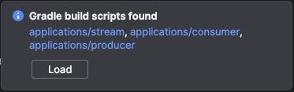
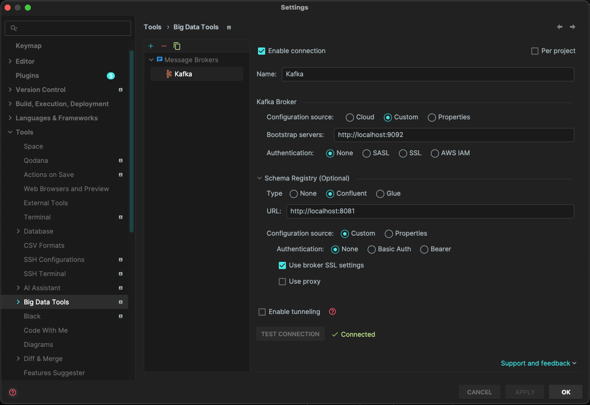
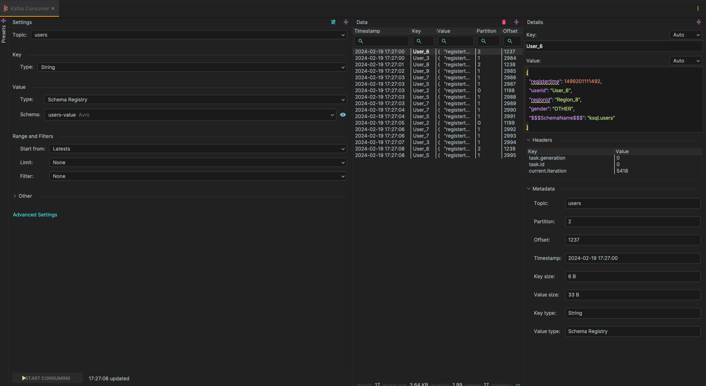
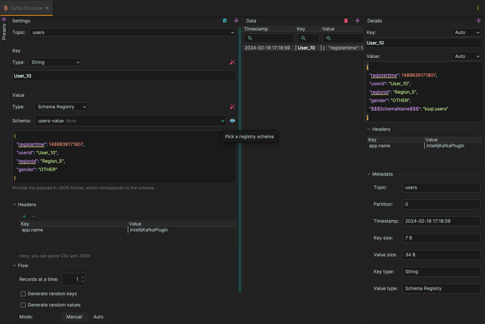

# Sandbox kafka

## Responsibility
Project to play with Kafka and to learn by doing

## Setup & Usage

### First setup - Jetbrains IDEA

#### Requirements
> [!IMPORTANT]  
> Make sure you allow 6GB of memory allocation to Docker.
* Docker
> [!TIP]
> Not needed to run the sample code, but to add further code. Check [JDK](#jdk) section for SDK setup suggestions.
* Java 21 (Not needed to run the sample code, but to add further code)
* Make

#### Applications

As the project contains 3 separate applications within the [applications folder](./applications), you will need to add all of them as gradle modules as shown below.

You can either accept the IDE proposal to load them all.



#### JDK

Each app is built with the latest Java LTS and Kotlin version at the moment.

So make sure you have on your local machine Java 21, if that's not the case I would suggest you to use [SDKMAN](https://sdkman.io/install), so you do not have to mess with the `PATH` at local machine.

Once it is installed make sure Jetbrains is using it, to code and to run gradle tasks.

### Use make for ease your life

If you have make installed it will call gradle and docker for you

In order to find out all the available commands use:

```bash
make help
```

### Run the project quickly

```bash
  make restart
```

I'm sure you are happy now because is running, 🎉 CONGRATULATIONS 🎉

Let's dive deep on what we have spin out.

* [confluentinc/cp-kafka](https://hub.docker.com/r/confluentinc/cp-kafka) - Docker image for deploying and running the Community Version of Kafka packaged with the Confluent Community download.
* [confluentinc/cp-schema-registry](https://hub.docker.com/r/confluentinc/cp-schema-registry) - Docker image for deploying and running the Schema Registry.
* [cnfldemos/kafka-connect-datagen](https://hub.docker.com/r/cnfldemos/kafka-connect-datagen) - kafka-connect-datagen is a Kafka Connect connector for generating mock data for testing
* [confluentinc/cp-enterprise-control-center](https://hub.docker.com/r/confluentinc/cp-enterprise-control-center) - Docker image for deploying and running Confluent's Control Center application that is packaged with Confluent Platform.
* [confluentinc/cp-kafka-rest](https://github.com/confluentinc/kafka-rest) - The Kafka REST Proxy provides a RESTful interface to a Kafka cluster. It makes it easy to produce and consume data, view the state of the cluster, and perform administrative actions without using the native Kafka protocol or clients

#### Applications

* [Consumer README](./applications/consumer/README.md)
* [Producer README](./applications/producer/README.md)
* [Stream README](./applications/stream/README.md)

### Run tests

In the application you will be able to find different kind of test.

* Unit test 
    * [Consumer](./applications/consumer/src/test/kotlin/io/carles/kafkaconsumer/UserPageViewsConsumerShould.kt)
    * [Producer](./applications/producer/src/test/kotlin/io/carles/kafkaproducer/RandomDetailedUserSenderShould.kt)
    * [Stream](./applications/stream/src/test/kotlin/io/carles/kafkastream/pipelines/UserPageViewsShould.kt)
* Integration Test 
    * [Consumer](./applications/consumer/src/test/kotlin/io/carles/kafkaconsumer/UserPageViewsConsumerIT.kt)
    * [Producer](./applications/producer/src/test/kotlin/io/carles/kafkaproducer/RandomDetailedUserSenderIT.kt)
    * [Stream](./applications/stream/src/test/kotlin/io/carles/kafkastream/pipelines/UserPageViewsIT.kt)

```bash
make test
```

#### A word on Integration Test
Integration test are useful to understand how your application is working and to figure out if your setup is correctly established,
however they add quite an amount of time on the CI pipelines, it is up to you to figure out if you need them or on the other hand
they are too time eager for the value they provide.

In the case of Kafka, provider and consumers can be easily "integration tested" with an EmbeddedKafka running in memory (quite fast to be honest),
however this utility is built on top of the CCS (Confluent Community Software) version of Kafka which is not compatible with the 
`Confluent Kafka-Streams` library built using the CE (Confluent Enterprise) version. The only alternative is to use Kafka in TestContainers, making it even slower.

### Big Data Tools
> [!WARNING] 
> This functionality is just available at Ultimate versions

Making of use of the [Big Data Tools](https://plugins.jetbrains.com/plugin/12494-big-data-tools) plugin is possible to establish 
a connection from the IDE using the details below.



Features:
  * Monitor Topics
  * Monitor Schema Registry
  * Monitor Consumer Groups
  * <details> <summary>Build Consumers</summary> 

    > 💡To reach this option right-click on the topic you are interested in.

    </details>

  * <details> <summary>Build Producers</summary> 
    
    > 💡To reach this option right-click on the topic you are interested in.

    </details>

### Debug your code
> [!WARNING] 
> This functionality is just available at Ultimate versions

Even though the code is executed within a Docker container it is possible to debug it. This is an extra tool which could 
help us understand the behaviour we are coding.
So in case you want to debug it we suggest you to boot Sandbox kafka using:

```bash
make restart
```
All the applications are already set up to expose a port (i.e. `5007`) to debug.

```yaml
  kfk-consumer:
    image: "kfk-consumer"
    build:
      context: ./applications/consumer/
      dockerfile: etc/docker/Dockerfile
    ports:
      - "5007:5007"
      - "8086:8080"
    depends_on:
      broker:
        condition: service_healthy
    env_file:
      - .env
    entrypoint:
      - java
      - -agentlib:jdwp=transport=dt_socket,server=y,suspend=n,address=*:5007
      - -jar
      - -Dfile.encoding=UTF-8
      - -Dspring.profiles.active=${PROFILE}
      - /app/kafka-consumer.jar
```

When using a Jetbrains IDE it is as simple as navigate to `Services` tab select 
the desired application and at the first line of its logs there is an option to attach a debugger to the mentioned port.

#### Alternative

If you are not an Ultimate user it is still possible to test the integration tests offered within this project.
