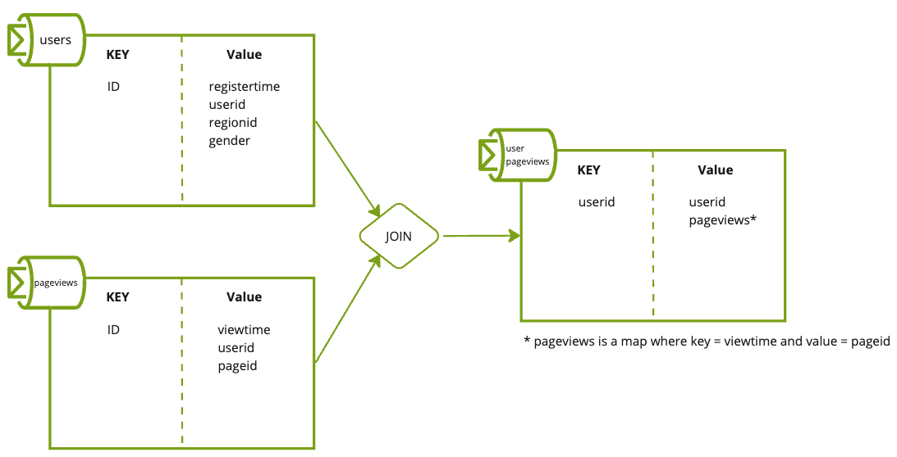
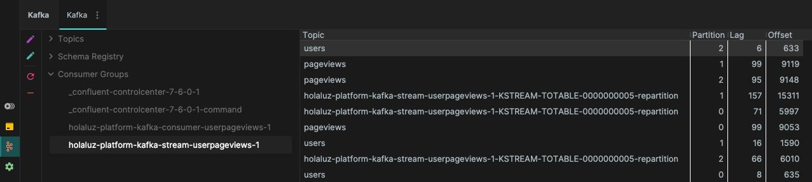

# STREAM

## Description
A **Kotlin application using the Kafka Streams library** is like having a Swiss Army knife for real-time data processing and analytics. Kotlin, with its concise syntax and powerful features, combined with Kafka Streams, offers a streamlined approach to building applications that can filter, aggregate, and transform streams of data with minimal fuss and maximum efficiency.

### Use Cases

* `Real-Time Analytics`: Just as you'd track sales in real time at our metaphorical market, Kafka Streams allows businesses to monitor key metrics and perform complex analytics on the fly. Think of monitoring website traffic, user behavior, or financial transactions in real-time to make data-driven decisions.
* `Event-Driven Architectures`: Imagine each stall in the market sending updates whenever a sale happens. Similarly, Kafka Streams is perfect for building systems that react to events as they occur, ensuring high responsiveness and resilience.
* `Data Integration and ETL Processes`: Just as goods are brought to the market from various sources, Kafka Streams can be used to gather data from diverse sources, transform it (cleanse, enrich, aggregate), and load it into databases, data lakes, or other systems for further analysis.
* `Microservices Communication`: Think of each stall as a microservice. Kafka Streams facilitates seamless communication between microservices, enabling them to share data efficiently and reliably, without stepping on each other's toes.

## Current example
This stream application joins the content of two topics already created and populated using a kafka-connect connector.[^1]



### In Action

>💡Pay close attention when navigating over the partitions, the same IDs always go into the same partition even on different topics.
>  This make easier to perform actions like `JOIN`, given this kind of action are performed within the same partition number 
>  from different topics.

### Consumer Lag

Within the Control Center is also possible to find out the consumer lag over the Stream Consumer Group `kafka-stream-userpageviews-1`

This could also be queried from Big Data Tools plugin.


[^1]: In order to trigger the population of the topics with kafka-connect run the following command.

```zsh
  make gen_data_connect
```

[^2]: To boot all the applications execute.

```zsh
  make restart
```
